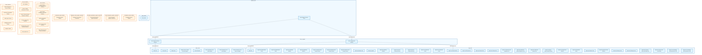

# Courts Visualisation

<!-- This file is automatically generated from scripts/build_courts_list. You shouldn't edit it manually. -->

```mermaid
graph TD
    classDef court fill:#e1f5ff,stroke:#01579b,stroke-width:2px,color:#000
    classDef tribunal fill:#fff3e0,stroke:#e65100,stroke-width:2px,color:#000
    classDef courtGroup fill:#f0f9ff,stroke:#01579b,stroke-width:2px,color:#000
    classDef tribunalGroup fill:#fffbf0,stroke:#e65100,stroke-width:2px,color:#000

    subgraph supreme_court["supreme_court"]
        UKSC["United Kingdom Supreme Court"]
    end
    class supreme_court courtGroup
    subgraph privy_council["privy_council"]
        UKPC["Privy Council"]
    end
    class privy_council courtGroup
    subgraph court_of_appeal["court_of_appeal"]
        EWCA-Civil["Court of Appeal (Civil Division)"]
        EWCA-Criminal["Court of Appeal (Criminal Division)"]
    end
    class court_of_appeal courtGroup
    subgraph high_court["high_court"]
        EWHC["High Court"]
        EWHC-QBD-Admin["High Court (Administrative Court)"]
        EWHC-KBD-Admin["High Court (Administrative Court)"]
        EWHC-QBD-Admiralty["High Court (Admiralty Division)"]
        EWHC-KBD-Admiralty["High Court (Admiralty Division)"]
        EWHC-QBD-BusinessAndProperty["High Court (Business and Property Courts)"]
        EWHC-KBD-BusinessAndProperty["High Courts (Business and Property Courts)"]
        EWHC-Chancery-BusinessAndProperty["High Court (Business and Property Courts)"]
        EWHC-Chancery-Business["High Court (Business List)"]
        EWHC-Chancery-Appeals["Chancery Appeals"]
        EWHC-Chancery["High Court (Chancery Division)"]
        EWHC-QBD-Commercial-Circuit["High Court (Circuit Commercial Court)"]
        EWHC-KBD-Commercial-Circuit["High Court (Circuit Commercial Court)"]
        EWHC-QBD-Commercial["High Court (Commercial Court)"]
        EWHC-KBD-Commercial["High Court (Commercial Court)"]
        EWHC-Family["High Court (Family Division)"]
        EWHC-QBD-Commercial-Financial["High Court (Financial List)"]
        EWHC-KBD-Commercial-Financial["High Court (Financial List)"]
        EWHC-Chancery-Financial["High Court (Financial List)"]
        EWHC-Chancery-InsolvencyAndCompanies["High Court (Insolvency and Companies List)"]
        EWHC-Chancery-IPEC["High Court (Intellectual Property Enterprise Court)"]
        EWHC-Chancery-IntellectualProperty["High Court (Intellectual Property List)"]
        TNA-EWHC-KBQBD["High Court (King's / Queen's Bench Division)"]
        EWHC-KBD["High Court (King's Bench Division)"]
        EWHC-Mercantile["High Court (Mercantile Court)"]
        EWHC-Chancery-Patents["High Court (Patents Court)"]
        EWHC-QBD["High Court (Queen's Bench Division)"]
        EWHC-QBD-Planning["High Court (Planning Court)"]
        EWHC-KBD-Planning["High Court (Planning Court)"]
        EWHC-Chancery-PropertyTrustsProbate["High Court (Property, Trusts and Probate List)"]
        EWHC-SeniorCourtsCosts["High Court (Senior Court Costs Office)"]
        EWHC-QBD-TCC["High Court (Technology and Construction Court)"]
        EWHC-KBD-TCC["High Court (Technology and Construction Court)"]
    end
    class high_court courtGroup
    subgraph lower_courts["lower_courts"]
        EWCR["Crown Court"]
        EWCC["County Court"]
        EWFC["Family Court"]
        EWFC-B["Family Court (B - district and circuit judges)"]
        EWCOP["Court of Protection"]
        EWCOP-T1["Court of Protection (Tier 1 - district judges)"]
        EWCOP-T2["Court of Protection (Tier 2 - circuit judges)"]
        EWCOP-T3["Court of Protection (Tier 3 - high court judges)"]
    end
    class lower_courts courtGroup
    subgraph investigatory_powers_tribunal["investigatory_powers_tribunal"]
        UKIPT["Investigatory Powers Tribunal"]
    end
    class investigatory_powers_tribunal tribunalGroup
    subgraph special_immigration_appeals_commission["special_immigration_appeals_commission"]
        SIAC["Special Immigration Appeals Commission"]
    end
    class special_immigration_appeals_commission tribunalGroup
    subgraph proscribed_organisations_appeal_commission["proscribed_organisations_appeal_commission"]
        POAC["Proscribed Organisations Appeal Commission"]
    end
    class proscribed_organisations_appeal_commission tribunalGroup
    subgraph pathogens_access_appeal_commission["pathogens_access_appeal_commission"]
        PAAC["Pathogens Access Appeal Commission"]
    end
    class pathogens_access_appeal_commission tribunalGroup
    subgraph employment_appeal_tribunal["employment_appeal_tribunal"]
        EAT["Employment Appeal Tribunal"]
    end
    class employment_appeal_tribunal tribunalGroup
    subgraph upper_tribunals["upper_tribunals"]
        UKUT-AAC["Upper Tribunal (Administrative Appeals Chamber)"]
        UKUT-IAC["Upper Tribunal (Immigration and Asylum Chamber)"]
        UKAIT["Asylum & Immigration Tribunal"]
        UKUT-LC["Upper Tribunal (Lands Chamber)"]
        UKUT-TCC["Upper Tribunal (Tax and Chancery Chamber)"]
    end
    class upper_tribunals tribunalGroup
    subgraph first_tier_tribunals["first_tier_tribunals"]
        UKFTT-HESC["Care Standards"]
        ET["First-tier Tribunal (Employment Tribunal)"]
        UKFTT-GRC["First-tier Tribunal (General Regulatory Chamber)"]
        UKFTT-TC["First-tier Tribunal (Tax Chamber)"]
        FTT-PC["Land Registration Division (Property Chamber)"]
        FTT-PHL["Primary Health Lists"]
    end
    class first_tier_tribunals tribunalGroup
    subgraph historic_tribunals["historic_tribunals"]
        FTT-Claims["Claims Management Services Tribunal"]
        UKFTT-Credit["Consumer Credit Appeals Tribunal"]
        UKFTT-Estate["Estate Agents Tribunal"]
        UKIST["Immigration Services Tribunal"]
        FTT-Transport["Transport Tribunal"]
    end
    class historic_tribunals tribunalGroup
    class UKSC court
    class UKPC court
    class EWCA-Civil court
    class EWCA-Criminal court
    class EWHC court
    class EWHC-QBD-Admin court
    class EWHC-KBD-Admin court
    class EWHC-QBD-Admiralty court
    class EWHC-KBD-Admiralty court
    class EWHC-QBD-BusinessAndProperty court
    class EWHC-KBD-BusinessAndProperty court
    class EWHC-Chancery-BusinessAndProperty court
    class EWHC-Chancery-Business court
    class EWHC-Chancery-Appeals court
    class EWHC-Chancery court
    class EWHC-QBD-Commercial-Circuit court
    class EWHC-KBD-Commercial-Circuit court
    class EWHC-QBD-Commercial court
    class EWHC-KBD-Commercial court
    class EWHC-Family court
    class EWHC-QBD-Commercial-Financial court
    class EWHC-KBD-Commercial-Financial court
    class EWHC-Chancery-Financial court
    class EWHC-Chancery-InsolvencyAndCompanies court
    class EWHC-Chancery-IPEC court
    class EWHC-Chancery-IntellectualProperty court
    class TNA-EWHC-KBQBD court
    class EWHC-KBD court
    class EWHC-Mercantile court
    class EWHC-Chancery-Patents court
    class EWHC-QBD court
    class EWHC-QBD-Planning court
    class EWHC-KBD-Planning court
    class EWHC-Chancery-PropertyTrustsProbate court
    class EWHC-SeniorCourtsCosts court
    class EWHC-QBD-TCC court
    class EWHC-KBD-TCC court
    class EWCR court
    class EWCC court
    class EWFC court
    class EWFC-B court
    class EWCOP court
    class EWCOP-T1 court
    class EWCOP-T2 court
    class EWCOP-T3 court
    class UKIPT tribunal
    class SIAC tribunal
    class POAC tribunal
    class PAAC tribunal
    class EAT tribunal
    class UKUT-AAC tribunal
    class UKUT-IAC tribunal
    class UKAIT tribunal
    class UKUT-LC tribunal
    class UKUT-TCC tribunal
    class UKFTT-HESC tribunal
    class ET tribunal
    class UKFTT-GRC tribunal
    class UKFTT-TC tribunal
    class FTT-PC tribunal
    class FTT-PHL tribunal
    class FTT-Claims tribunal
    class UKFTT-Credit tribunal
    class UKFTT-Estate tribunal
    class UKIST tribunal
    class FTT-Transport tribunal

    EWCA-Civil -->|"hears appeals from"| EWHC
    EWCA-Civil -->|"hears appeals from"| EWHC-Family
    EWCA-Criminal -->|"hears appeals from"| EWCR
    UKSC -->|"hears appeals from"| EWCA-Civil
    UKSC -->|"hears appeals from"| EWCA-Criminal
```
